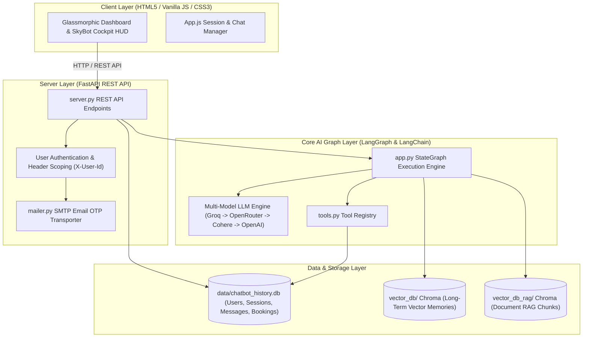
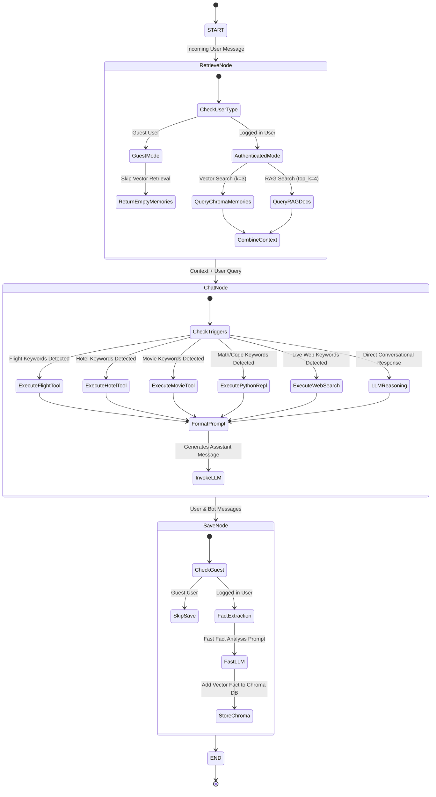
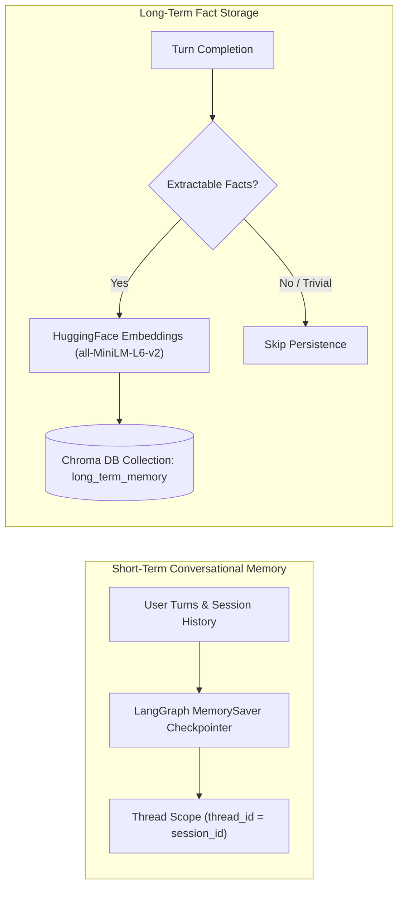
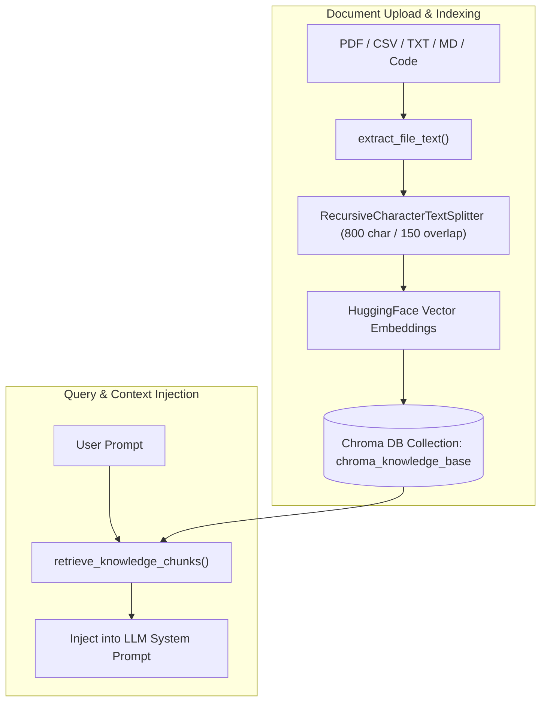
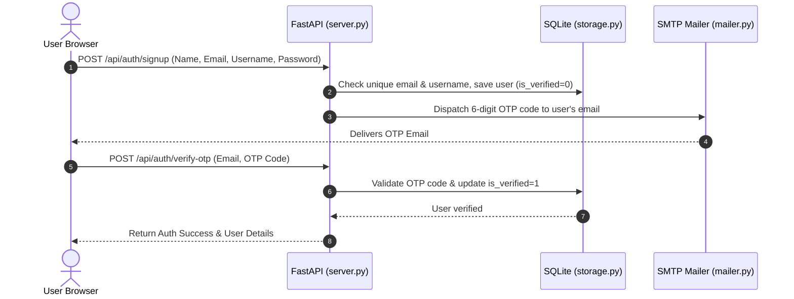

# BOT-O-BRAIN — Stateful Dual-Memory AI Companion, Document RAG & Services Ecosystem

BOT-O-BRAIN is an enterprise-grade, stateful AI assistant ecosystem powered by **LangGraph**, **Groq / OpenAI**, **Chroma Vector DB**, **SerpApi Google Flights**, and **SQLite**. It features a **Dual-Memory Architecture** (short-term conversational checkpointer + long-term persistent fact extraction memory), a **Document Knowledge Base (RAG)**, an **AI Services Hub (Flights, Hotels, Movies)**, and **SkyBot** — an immersive flight booking concierge with a full-screen flight simulator cockpit UI.

---

## Table of Contents
1. [Overview & Core Capabilities](#overview--core-capabilities)
2. [System Flow Architecture & Diagrams](#system-flow-architecture--diagrams)
   - [1. High-Level Layered System Architecture](#1-high-level-layered-system-architecture)
   - [2. LangGraph Turn Execution Pipeline](#2-langgraph-turn-execution-pipeline)
   - [3. Dual Memory Architecture Flow](#3-dual-memory-architecture-flow)
   - [4. Document RAG Ingestion & Query Pipeline](#4-document-rag-ingestion--query-pipeline)
   - [5. Secure Authentication & Email OTP Flow](#5-secure-authentication--email-otp-flow)
3. [How Things Work: Component Deep-Dive](#how-things-work-component-deep-dive)
4. [Directory & Module Layout](#directory--module-layout)
5. [Database Schemas & Vector Stores](#database-schemas--vector-stores)
6. [API Endpoints Reference](#api-endpoints-reference)
7. [Installation & Setup Guide](#installation--setup-guide)

---

## Overview & Core Capabilities

BOT-O-BRAIN combines real-time conversational capabilities with domain-specific AI tools, vector knowledge retrieval, and persistent user memories:

* **Dual-Memory Architecture**:
  * **Short-Term Memory**: Multi-turn conversation context preserved across turns per thread/session using LangGraph's `MemorySaver` checkpointer.
  * **Long-Term Fact Store**: Automatic LLM extraction of durable facts (user preferences, goals, background, hobbies) stored as vector embeddings in **Chroma DB** (`./vector_db`) scoped per user.

* **SkyBot Flight Concierge & Cockpit**:
  * Real-time flight availability searches via Google Flights (SerpApi & RapidAPI failover).
  * Interactive PNR reservation, status checks, fare comparisons, and simulated UPI e-ticket payments.
  * Immersive full-screen flight simulator video background and telemetry HUD (`ALT: 35,000 FT`, `SPEED: 480 KTS`, `RADAR: ONLINE`).

* **Document Knowledge Base (RAG)**:
  * Ingestion of PDFs, CSVs, TXT, Markdown, JSON, and Python code files.
  * `RecursiveCharacterTextSplitter` (800-char chunks, 150 overlap) indexed in a dedicated vector collection (`./vector_db_rag`).

* **AI Services Hub**:
  * **Hotel Booking Engine**: City-wide hotel search, room reservations, PNR tracking (`PNR-HTL...`).
  * **Movie Ticket Suite**: Movie search, cinema showtimes, ticket booking (`PNR-MOV...`).
  * **Python REPL & Calculator**: Safe Python code execution environment for math algorithms and financial metrics.
  * **Live Web Search**: Real-time web searching powered by DuckDuckGo.

* **Multi-Tenant Auth & Email OTP**:
  * User registration with salted SHA-256 password hashing.
  * 6-digit Email OTP verification dispatched via SMTP.
  * Isolated memory spaces, session histories, and document libraries per user.

---

## System Flow Architecture & Diagrams

### 1. High-Level Layered System Architecture



---

### 2. LangGraph Turn Execution Pipeline

Every user prompt processed by `app.py` passes through a deterministic state graph:



---

### 3. Dual Memory Architecture Flow



---

### 4. Document RAG Ingestion & Query Pipeline



---

### 5. Secure Authentication & Email OTP Flow



---

## How Things Work: Component Deep-Dive

### 1. Multi-Model LLM Orchestration (`app.py`)
BOT-O-BRAIN implements a multi-provider fallback hierarchy to ensure reliability:
1. **Vision Engine**: Triggered automatically when image attachments are present (`llama-3.2-90b-vision-preview` / `gemini-2.5-flash`).
2. **Primary Text LLM**: Groq `llama-3.3-70b-versatile` for high-reasoning accuracy.
3. **Fast LLM**: Groq `llama-3.1-8b-instant` for ultra-fast fact extraction in `save_node`.
4. **Failover Providers**: Automatic fallback to OpenRouter (`deepseek-r1:free`), Cohere (`command-r-plus`), and OpenAI (`gpt-4o-mini`).

### 2. Multi-Tenant Session & Database Isolation (`storage.py`)
All sessions, message histories, and flight/hotel/movie reservations are keyed by `user_id`. When a request arrives with an `X-User-Id` header:
- Guest users (`usr_guest`) have access to conversational services but do **not** trigger Chroma DB long-term fact storage.
- Verified users have strict multi-tenant isolation across SQLite and Chroma vector store metadata queries.

### 3. SkyBot Flight Engine (`booking_system/flight_service.py`)
SkyBot uses a multi-tier live search architecture:
- **Tier 1 (SerpApi)**: Direct integration with Google Flights for real-time fares and flight numbers.
- **Tier 2 (RapidAPI)**: Fallback flight search API.
- **Tier 3 (Catalog Engine)**: Instant fallback pricing catalog for seamless uninterrupted demo execution.
- Includes a 15-minute sub-5ms in-memory cache to optimize API quota usage.

---

## Directory & Module Layout

```text
ProjectMemoryChatbot/
├── app.py                  # LangGraph execution pipeline, nodes, LLM failover & Chroma DB
├── server.py               # FastAPI REST API backend & static file server
├── rag.py                  # Document RAG text extraction, chunking & Chroma RAG indexing
├── storage.py              # SQLite storage (users, OTP, sessions, messages, flight bookings)
├── mailer.py               # SMTP email transporter for 6-digit OTP dispatching
├── tools.py                # Agent tools (Web Search, Python REPL, Memory, RAG, Services)
├── generate_graph_png.py   # Script generating graph.png Mermaid representation
├── graph.png               # Rendered architecture visualization image
├── booking_system/         # AI Services Subsystem
│   ├── booking_db.py       # Dedicated SQLite storage for flight bookings
│   ├── booking_tools.py    # Flight search, booking, payment & status tools
│   ├── flight_service.py   # Live Google Flights search engine & SerpApi provider
│   ├── hotel_service.py    # Hotel search catalog & room reservation engine
│   ├── hotel_tools.py      # Hotel agent tools
│   ├── movie_service.py    # Movie catalog & ticket booking engine
│   └── movie_tools.py      # Movie agent tools
├── static/                 # Frontend User Interface
│   ├── index.html          # HTML5 layout & SkyBot Cockpit HUD deck
│   ├── style.css           # Glassmorphic Light Studio & Midnight Dark CSS
│   └── app.js              # Client application controller & state manager
├── data/                   # SQLite database storage directory
│   └── chatbot_history.db  # Main database file
├── vector_db/              # Chroma DB store for user fact memories
├── vector_db_rag/          # Chroma DB store for document RAG knowledge base
├── .env                    # Environment API keys configuration
└── README.md               # Project documentation
```

---

## Database Schemas & Vector Stores

### SQLite Tables (`data/chatbot_history.db`)

#### `users`
| Column | Type | Constraints | Description |
| :--- | :--- | :--- | :--- |
| `id` | TEXT | PRIMARY KEY | User ID (`usr_...`) |
| `full_name` | TEXT | NOT NULL | User's full name |
| `email` | TEXT | UNIQUE | User's email address |
| `username` | TEXT | UNIQUE, NOT NULL | Username identifier |
| `password_hash` | TEXT | NOT NULL | Salted SHA-256 password hash |
| `is_verified` | INTEGER | DEFAULT 0 | Email verification status (1=verified) |
| `otp_code` | TEXT | | Current 6-digit OTP code |
| `created_at` | TEXT | NOT NULL | Account creation timestamp |

#### `sessions`
| Column | Type | Constraints | Description |
| :--- | :--- | :--- | :--- |
| `id` | TEXT | PRIMARY KEY | Session ID UUID |
| `user_id` | TEXT | FOREIGN KEY | Associated user ID |
| `title` | TEXT | NOT NULL | Session display title |
| `assistant_type` | TEXT | DEFAULT 'general' | Assistant mode (`general` or `flight`) |
| `created_at` | TEXT | NOT NULL | Creation ISO timestamp |
| `updated_at` | TEXT | NOT NULL | Last update ISO timestamp |

#### `flight_bookings`
| Column | Type | Constraints | Description |
| :--- | :--- | :--- | :--- |
| `id` | TEXT | PRIMARY KEY | Booking UUID |
| `pnr` | TEXT | UNIQUE, NOT NULL | Flight PNR code (`PNR-BOB...`) |
| `user_id` | TEXT | FOREIGN KEY | Associated user ID |
| `origin` | TEXT | NOT NULL | Departure city / airport |
| `destination` | TEXT | NOT NULL | Arrival city / airport |
| `travel_date` | TEXT | NOT NULL | Travel date |
| `flight_number` | TEXT | NOT NULL | Airline flight code |
| `airline` | TEXT | NOT NULL | Airline name |
| `passenger_name` | TEXT | NOT NULL | Passenger full name |
| `price_inr` | INTEGER | NOT NULL | Fare price in INR |
| `payment_status` | TEXT | NOT NULL | Status (`PENDING_PAYMENT` / `PAID`) |

---

## API Endpoints Reference

### Authentication Endpoints (`/api/auth`)
* `POST /api/auth/signup`: Register a new user account and dispatch 6-digit OTP to email.
* `POST /api/auth/verify-otp`: Validate 6-digit OTP code to verify account.
* `POST /api/auth/resend-otp`: Dispatch a new OTP code to user's email.
* `POST /api/auth/login`: Authenticate using Email/Username and Password.
* `GET /api/auth/me`: Retrieve current logged-in user profile.

### Chat & Sessions Endpoints (`/api/chat`, `/api/sessions`)
* `POST /api/chat`: Send prompt (`message`, `session_id`, `chat_mode`, `assistant_type`, `attachment`) and receive AI response.
* `GET /api/sessions`: List sessions for active user.
* `POST /api/sessions`: Create a new chat session.
* `GET /api/sessions/{id}/messages`: Fetch session message history.
* `DELETE /api/sessions/{id}`: Delete a session and its message history.

### Long-Term Memory & RAG Endpoints (`/api/memories`, `/api/rag`)
* `GET /api/memories`: Retrieve stored long-term vector facts for active user.
* `POST /api/memories`: Manually store a memory fact.
* `DELETE /api/memories/{memory_id}`: Delete a vector memory fact.
* `POST /api/rag/upload`: Ingest PDF, CSV, TXT, Markdown, or Python files for document RAG.
* `GET /api/rag/documents`: List ingested document files.
* `DELETE /api/rag/documents/{filename}`: Delete an ingested document from vector index.

---

## Installation & Setup Guide

### 1. Prerequisites
* **Python 3.10+**

### 2. Installation
```bash
# Clone the repository
git clone https://github.com/srivastava071/BOT-O-BRAIN.git
cd ProjectMemoryChatbot

# Install required dependencies
pip install fastapi uvicorn langgraph langchain-core langchain-openai \
            langchain-chroma chromadb python-dotenv langchain-huggingface \
            sentence-transformers pypdf requests duckduckgo-search bcrypt
```

### 3. Environment Configuration (`.env`)
Create a `.env` file in the project root:

```env
# Chat LLM API Key (Get a free key at https://console.groq.com)
GROQ_API_KEY=gsk_your_groq_api_key_here

# Live Google Flights Search Key (SerpApi)
SERPAPI_KEY=your_serpapi_key_here

# HuggingFace Token (Optional, for downloading embedding models)
HF_TOKEN=hf_your_token_here

# Email OTP Transporter Settings (Optional, SMTP Gmail Example)
SMTP_SERVER=smtp.gmail.com
SMTP_PORT=587
SMTP_EMAIL=your_email@gmail.com
SMTP_PASSWORD=your_gmail_app_password
```

### 4. Launch Application
Start the FastAPI server:

```bash
python server.py
# or
uvicorn server:app --reload --port 8000
```

Open your browser and navigate to:
http://localhost:8000
