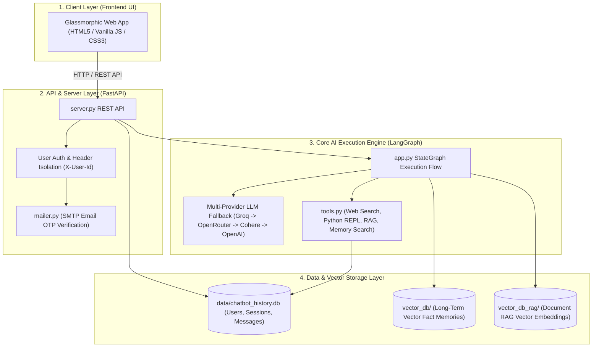
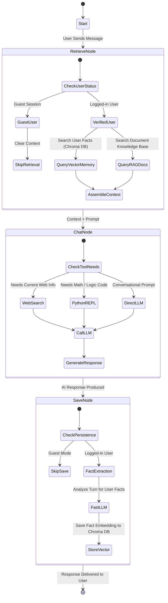

# BOT-O-BRAIN — AI Chatbot Architecture & System Overview

Welcome to **BOT-O-BRAIN**, an enterprise-grade, stateful AI Chatbot ecosystem designed for intelligent, context-aware, and multi-turn human-AI interaction.

BOT-O-BRAIN combines **LangGraph Agentic Orchestration**, **Dual-Memory Architecture** (Short-term checkpointer + Long-term Vector Store), **Document RAG (Retrieval-Augmented Generation)**, **Agentic Tool Calling**, and a **Multi-LLM Fallback Engine** to deliver a fast, resilient, and highly personalized AI assistant experience.

---

## 💡 Executive Summary (The Core Idea)

Traditional AI chatbots suffer from two major problems:
1. **Forgetfulness**: Once a session ends or gets long, the chatbot forgets who you are, your preferences, and previous context.
2. **Static Knowledge**: Chatbots cannot access your custom files or perform real-time actions like web searches or Python calculations.

**BOT-O-BRAIN solves both**:
- **It Remembers You**: Using a **Dual-Memory** approach, it maintains smooth active conversation threads while automatically extracting and storing durable facts about you in a persistent vector database.
- **It Takes Action**: Equipped with **Agentic Tools**, the chatbot can query live internet data, execute Python code for complex math/logic, and retrieve knowledge from uploaded PDF/CSV/code documents.

---

## 🏗️ High-Level System Architecture

The BOT-O-BRAIN architecture is built with a modern, decoupled layered design. Here is how all the components fit together in an easy-to-understand layout:



---

## 🔄 Turn Execution Pipeline (How a Message is Processed)

Every message sent to BOT-O-BRAIN follows a deterministic 5-step processing pipeline:



### Step-by-Step Flow Explanation:
1. **Retrieve Node**: Upon receiving a message, the chatbot checks if the user is authenticated. If yes, it performs semantic vector searches in **Chroma DB** to pull relevant user memories and document RAG chunks, injecting them into the system prompt.
2. **Chat Node**: The LLM evaluates the prompt. If the query requires real-time information or calculation, it invokes **Agentic Tools** (DuckDuckGo Web Search or Python REPL).
3. **LLM Generation**: The central multi-model LLM engine generates the final conversational response.
4. **Save Node**: For logged-in users, a fast background LLM automatically extracts long-term facts (e.g., *"User is a software developer living in Seattle"*) and persists them as vector embeddings for future turns.

---

## 🧬 Core Architecture Pillars Explained

### 1. Dual-Memory Architecture 🧠
BOT-O-BRAIN separates short-term context from long-term knowledge:
* **Short-Term Conversational Memory**: Managed by LangGraph's `MemorySaver` checkpointer. Tracks immediate dialogue turns for each session thread (`session_id`).
* **Long-Term Fact Store**: Powered by **Chroma Vector DB** (`./vector_db`). Extracted facts are converted into embeddings via HuggingFace `all-MiniLM-L6-v2`. Every vector is tagged with `user_id` metadata to ensure strict privacy and data isolation between users.

### 2. Document RAG (Retrieval-Augmented Generation) 📚
* **Ingestion**: Supports uploading PDFs, CSVs, TXT, Markdown, JSON, and Python source files.
* **Chunking & Indexing**: Uses `RecursiveCharacterTextSplitter` (800-character chunks with 150-character overlap) to index text into a dedicated Chroma DB collection (`./vector_db_rag`).
* **Retrieval**: When a query touches on document knowledge, top relevant chunks are automatically retrieved and supplied as context to the chatbot.

### 3. Agentic Tools Suite 🛠️
* **Web Search (`web_search_tool`)**: Real-time internet search via DuckDuckGo (`ddgs`) for news, current events, and live web information.
* **Python REPL (`python_repl_tool`)**: Executable environment for computing complex math, financial formulas, string transformations, and algorithm logic cleanly.
* **Memory Search (`memory_search_tool`)**: Tool enabling the assistant to explicitly look up past facts stored in Chroma DB.
* **RAG Search (`rag_search_tool`)**: Tool enabling explicit vector searches over user-uploaded documents.

### 4. Multi-Model LLM Resilience ⚡
To maintain 99.9% uptime and avoid rate limits or API downtime, BOT-O-BRAIN implements an automated provider fallback strategy:
1. **Primary LLM**: Groq (`llama-3.3-70b-versatile`) — Ultra-fast inference with high reasoning accuracy.
2. **Fast Extraction LLM**: Groq (`llama-3.1-8b-instant`) — Lightweight model for instant background fact extraction.
3. **Vision LLM**: Groq / Gemini Vision models for analyzing attached image files.
4. **Failover Tier**: Automatic fallback to **OpenRouter** (`deepseek-r1`), **Cohere** (`command-r-plus`), and **OpenAI** (`gpt-4o-mini`).

### 5. Security & Multi-Tenant Isolation 🔒
* **Password Hashing**: User passwords are stored using salted SHA-256 encryption.
* **Email OTP Verification**: Account registration requires 6-digit email OTP verification dispatched via SMTP.
* **User Isolation**: All sessions, message logs, vector memories, and RAG uploads are strictly isolated using `X-User-Id` request scoping.

---

## 🛠️ Technology Stack Breakdown

| Layer | Technology | Purpose |
| :--- | :--- | :--- |
| **Agentic Framework** | **LangGraph / LangChain Core** | Graph execution, state transitions, tool bindings, and checkpointer memory |
| **Backend API** | **FastAPI + Uvicorn** | High-performance async REST API, static asset server, and middleware |
| **Primary LLMs** | **Groq (Llama 3.3 70B & Llama 3.1 8B)** | High-speed inference for main chat and fast fact extraction |
| **LLM Failover Providers** | **OpenRouter, Cohere, OpenAI** | Automatic failover during primary provider rate limits or downtime |
| **Vector Database** | **Chroma DB (`chromadb`)** | Semantic vector storage for user long-term facts & document RAG |
| **Embedding Models** | **HuggingFace (`all-MiniLM-L6-v2`)** | Local, fast text-to-vector embedding generation |
| **Relational Storage** | **SQLite (`chatbot_history.db`)** | Storing user accounts, sessions, message history, and verification tokens |
| **Tools & Utilities** | **DuckDuckGo Search, Python REPL, PyPDF** | Web searching, safe code evaluation, and PDF document parsing |
| **Frontend UI** | **HTML5, Vanilla JavaScript (ES6+), Glassmorphic CSS3** | Dynamic responsive web UI with light/dark theme modes |

---

## 📁 Directory & Module Structure

```text
ProjectMemoryChatbot/
├── app.py                  # Core LangGraph execution graph, state nodes, LLM failover, & Chroma memory
├── server.py               # FastAPI REST API backend endpoints & static frontend server
├── rag.py                  # Document RAG text extractor, Recursive Splitter, & Chroma RAG indexer
├── storage.py              # SQLite database manager (users, auth, sessions, message records)
├── mailer.py               # SMTP email transporter for sending 6-digit OTP verification codes
├── tools.py                # Agent tools (DuckDuckGo search, Python REPL, RAG & Memory search)
├── static/                 # Web Frontend Interface
│   ├── index.html          # Clean HTML5 Dashboard UI layout
│   ├── style.css           # Glassmorphic Light Studio & Midnight Dark CSS styles
│   └── app.js              # Client app state controller, chat rendering, & API communications
├── data/                   # Relational database folder
│   └── chatbot_history.db  # SQLite database storing core app data
├── vector_db/              # Chroma DB collection storing long-term user fact memories
└── vector_db_rag/          # Chroma DB collection storing uploaded document RAG chunks
```

---

## 🗄️ Database Schemas (At a Glance)

### `users` Table
Stores user account profiles and verification status:
* `id` (TEXT, Primary Key)
* `full_name`, `email` (UNIQUE), `username` (UNIQUE)
* `password_hash` (Salted SHA-256)
* `is_verified` (INTEGER 0/1), `otp_code` (TEXT)

### `sessions` Table
Stores user chat session threads:
* `id` (TEXT, Primary Key UUID)
* `user_id` (TEXT, Foreign Key -> `users.id`)
* `title` (TEXT)
* `created_at`, `updated_at` (ISO Timestamps)

### `messages` / `chat_history` Table
Stores turn-by-turn conversational history:
* `id` (TEXT, Primary Key)
* `session_id` (TEXT, Foreign Key -> `sessions.id`)
* `sender` (`human` / `assistant` / `system` / `tool`)
* `content` (TEXT)
* `timestamp` (ISO Timestamp)

---

## ⚡ Quick Start Guide

### 1. Requirements
* **Python 3.10+**

### 2. Installation
```bash
# Clone the repository
git clone https://github.com/srivastava071/BOT-O-BRAIN.git
cd ProjectMemoryChatbot

# Install dependencies
pip install fastapi uvicorn langgraph langchain-core langchain-openai \
            langchain-chroma chromadb python-dotenv langchain-huggingface \
            sentence-transformers pypdf requests duckduckgo-search
```

### 3. Environment Variables (`.env`)
Create a `.env` file in the root folder:
```env
GROQ_API_KEY=gsk_your_groq_api_key_here
OPENAI_API_KEY=your_openai_key_optional
OPENROUTER_API_KEY=your_openrouter_key_optional
COHERE_API_KEY=your_cohere_key_optional

SMTP_SERVER=smtp.gmail.com
SMTP_PORT=587
SMTP_EMAIL=your_email@gmail.com
SMTP_PASSWORD=your_gmail_app_password
```

### 4. Run Server
```bash
python server.py
```
Open **`http://localhost:8000`** in your browser to access the BOT-O-BRAIN Chatbot interface!

---

## 🌟 Summary

**BOT-O-BRAIN Chatbot** is built to bridge the gap between static conversational AI and truly memory-aware, tool-equipped AI companions. With its robust **Dual-Memory system**, **Document RAG**, **Agentic Tool calling**, and **Multi-LLM resilience**, it delivers an intelligent, stateful, and secure chatbot experience.
